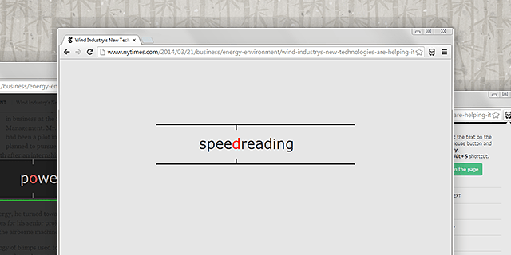

# Reedy

**Read all you want faster with Reedy for Google Chrome!**

Reedy is an advanced implementation of speed reading.
Words are shown fast one after another on the same place of the screen which increases the speed of perception of every single word.
You spend no more time on moving your eyes along the lines.

Now you’ll be able to read twice, three or even four times faster than you used to read.
Reading from left to right, and up and down has become hopelessly outdated.
Now you can read being entirely absorbed into the text.
Rolling and moving along the lines won’t distract you anymore.

Chrome Web Store:
https://chrome.google.com/webstore/detail/reedy/ihbdojmggkmjbhfflnchljfkgdhokffj

### How to use Reedy

1. Install the extension;
2. Select the text on the page;
3. Click the right button and choose Reedy. You can also use the «Alt+S» shortcut while the text is selected.

**Also you can launch Reedy without text selection.**
Just press Alt+S and hover your mouse over the block containing the text you want to read.
The block will be highlighted in green.
Click to start reading.

### Features

* The speed is up to 2000 words per minute with a possible gradual acceleration;
* Progress bar and time left till the end of reading;
* Quick preview of the context during a pause;
* Reading PDF files;
* Ability to paste custom text (offline using);
* Recognition of general entities (URLs, words with a dash, phone numbers, etc.). Analysis of the punctuation;
* Smart slowing – slow down the speed at a punctuation mark;
* Focus mode – the focus point is shifted closer to the beginning of a word;
* Scrollbar for the easy navigation through the text;
* Showing the text which follows the current word;
* Light and dark themes, background transparency, customizable colors and font styles;
* Adjustable position of the reading area;
* Automatical start of the reading;
* Different font sizes;
* Navigating through the words and sentences;
* Simple and intuitive interface.

### Shortcuts

* Alt+S – launch Reedy while the text is selected;
* Space (or Enter) – play/pause;
* Right/Left – next/previous word;
* Ctrl+Right/Left – next/previous sentence (you can also use the mouse wheel);
* End/Home – go to the end/beginning;
* Up/Down – increase/decrease the speed;
* +/- – larger/smaller font size;
* Esc – close Reedy.

### Contacts

Join us:
* https://www.facebook.com/reedy.speedreading
* https://twitter.com/reedy_speedread
* https://vk.com/reedy_speedreading

Contact developer:
* https://www.facebook.com/olegcherr
* https://vk.com/olegcherr

Donate: http://reedy.azagroup.ru/en/donate

### License

**Reedy is fully open source and licensed under the GNU GPL v2.**

Keywords: fast reader, spritz-like, spread, spreed, readline, jetzt, sprint, RSVP, Rapid serial visual presentation
